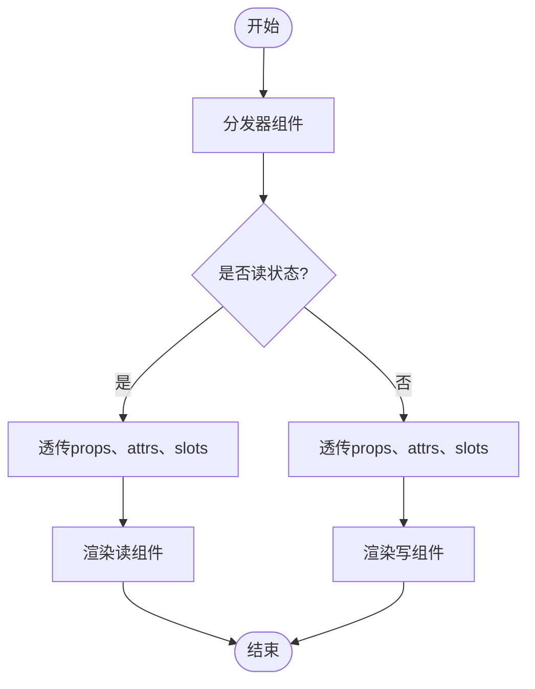

# 分发器原理

以 ElInput 组件为例，分发器的工作原理如下：



可以看出来，无论读写状态，分发器组件都会透传`props`、`attrs`、`slots`，最后根据状态渲染不同的组件。

那么如何透传`props`、`attrs`、`slots`？

有三种方式：

1. 渲染函数 `h`
2. Jsx
3. template 模板

## 渲染函数 `h` 透传

```ts
import { h, type SetupContext } from "vue";
import { Son, type Props } from "xxx";

const Father = (props: Props, { attrs, slots }: SetupContext) => {
  return h(Son, { ...attrs, ...props }, slots);
};
```

## Jsx 透传

```tsx
import { type SetupContext } from "vue";
import { Son, type Props } from "xxx";

const Father = (props: Props, { attrs, slots }: SetupContext) => {
  return <Son {...attrs} {...props} v-slots={slots} />;
};
```

## template 模板 透传

```vue
<script setup lang="ts">
import { Son } from "xxx";
</script>

<template>
  <Son v-bind="{ ...$props, ...$attrs }">
    <template v-for="(_, name) in $slots" :key="name" #[name]="scope">
      <slot :name="name" v-bind="scope || {}"></slot>
    </template>
  </Son>
</template>
```
